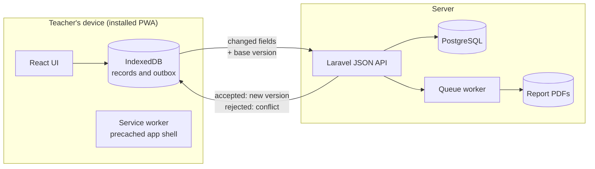

# ConnectED

Offline-first examination management and academic analytics for Kenyan schools with
unreliable connectivity.


A teacher enters marks in a classroom with no signal, a head of department reviews
class performance that evening on a phone with one bar, and the school's records
still end up consistent. ConnectED is a final-year capstone by two developers,
due at the end of November 2026.

## The problem

Schools in low-connectivity areas run examinations on paper and spreadsheets because
the web tools available to them assume a connection. Marks are transcribed several
times, analytics arrive weeks late, and when two people edit the same record, one
version silently wins.

ConnectED treats no connectivity as the normal state, not the exception. The
application installs as a PWA, works entirely from a local store, and synchronises
when a connection happens to exist. Concurrent edits to the same record are detected
and resolved on the record itself, not by whichever device uploaded last.

## How it works



The ideas that carry the design. Those with a decision record link to it in
[`docs/adr/`](docs/adr/); the rest are the data rules in [`AGENTS.md`](AGENTS.md):

- **Client-generated UUIDs.** Records are created offline, so primary keys cannot
  wait for the server.
- **Integer versions, not timestamps.** Every synchronisable record carries a
  `version` that only the server increments. A write is accepted when its base
  version matches; otherwise it is a conflict. Wall clocks on teacher devices are
  not trusted ([ADR 0001](docs/adr/0001-record-versioning.md)).
- **Field-level sync.** The outbox sends changed fields, never whole rows, so
  disjoint edits to one record merge without a conflict.
- **Conflicts are resolved by the right people.** A teacher resolves conflicts
  between their own devices directly; conflicts between two teachers go through a
  proposal and referral flow, because a party will keep their own number
  ([ADR 0002](docs/adr/0002-conflict-resolution.md)).
- **Soft deletes everywhere.** Update-against-delete is a real conflict case and
  cannot be represented if rows disappear.
- **Multi-tenancy by a global scope.** Every table carries `institution_id`,
  enforced by an Eloquent global scope rather than per-query discipline.
- **Absent is a value.** An absent mark is an explicit enum, never a null, and is
  excluded from analytics by an explicit predicate.

The synchronisation layer (local store, outbox, version check, merge, and conflict
flow) is the project's own implementation. Supporting concerns use maintained tools:
Workbox for the service worker ([ADR 0004](docs/adr/0004-offline-with-workbox.md)),
Laravel Sail for the containers.

## Stack

| Layer | Choice | Notes |
|---|---|---|
| Frontend | React 19, TypeScript, Vite 8, Tailwind 4 | PWA in [`frontend/`](frontend/); own router, own charts ([ADR 0003](docs/adr/0003-charts-without-a-library.md)) |
| Offline | Workbox via `vite-plugin-pwa`, IndexedDB | Precached shell; local store with a mutation outbox |
| API | Laravel 13, Sanctum tokens, queues | JSON only in [`api/`](api/); not Inertia, not a monolith |
| Database | PostgreSQL 18 | Client UUID keys, integer versions, soft deletes |
| Files | S3-compatible object storage | Generated report PDFs |
| Dev environment | Docker via Laravel Sail, Node 22 | API in containers, frontend native |

The two halves are separate applications sharing one repository. Nothing at runtime
crosses the client-server boundary except the JSON API.

## Repository layout

```
api/         Laravel JSON API (compose.yaml lives here; run it through Sail)
frontend/    React PWA (fixtures, service worker, own router and charts)
docs/adr/    Architecture decision records, numbered
Makefile     Front door for setup and daily commands
AGENTS.md    Rules for coding agents and humans: data rules, frontend rules, conventions
```

## Getting started

You need **Git**, **Docker** (Docker Desktop on Windows or macOS, Docker Engine with
the Compose plugin on Linux), **Node 22** (`.nvmrc` is set; `nvm use` picks it up),
and **make**.

You do not need PHP, Composer, or PostgreSQL. The one-time `composer install` runs
in a throwaway container, and everything else on the API side runs inside Sail.

```sh
git clone https://github.com/Robbymwangi/connected.git
cd connected
make setup     # composer install in Docker, .env, sail up, key:generate, migrate, npm ci
make dev       # frontend on http://localhost:5173
```

The first `make setup` builds the Sail image and takes a few minutes. The API answers
on http://localhost:8000 (`GET /api/user` returns 401 until you have a token; that is
the success case). Run `make` alone to list every target.

### Day to day

```sh
make up        # start API, Postgres, and the queue worker (data kept between runs)
make dev       # frontend dev server, live reload, no service worker
make offline   # production build on :4173, the app as installed; test offline here
make check     # typecheck, lint, Vitest, and Pest: what must pass before a commit
make down      # stop the containers
```

Anything Sail can do is available from `api/` as `./vendor/bin/sail <command>`
(`sail artisan`, `sail composer`, `sail shell`, `sail logs`); the Makefile only wraps
the common ones. Read [`frontend/README.md`](frontend/README.md) for the npm scripts
and how to try the offline behaviour.

### Windows with WSL2

Everything runs inside WSL; Windows is only the host for Docker Desktop, the browser,
and the editor window.

1. Install Docker Desktop, enable the WSL2 backend, and turn on WSL integration for
   your distribution (Settings, Resources, WSL integration). `docker` then works
   inside the WSL shell with no separate install.
2. Clone the repository **inside the Linux filesystem** (under `~`), never under
   `/mnt/c/...`. Bind mounts and file watching across the Windows boundary are slow,
   and Vite's live reload misses changes there.
3. Install Node inside WSL with [nvm](https://github.com/nvm-sh/nvm), not the Windows
   Node. `sudo apt install make` if `make` is missing.
4. Open the folder with VS Code's WSL extension (`code .` from the WSL shell) so the
   terminal, Git, and Node are all the Linux ones.
5. The Windows browser reaches `localhost:5173` and `localhost:8000` directly; WSL
   forwards the ports.
6. If `docker pull` fails with `error getting credentials`, Docker Desktop's
   credential helper has lost its link to Windows. Restart Docker Desktop.
7. Playwright's end-to-end tests need `npx playwright install --with-deps chromium`
   once, which needs sudo; some WSL images also lack `libasound2`. Unit tests and
   type checks do not need a browser.

Line endings are normalised to LF by `.gitattributes` whatever your Git settings.

### macOS and Linux

macOS: Docker Desktop (or OrbStack), nvm, and `make` from the Xcode command line
tools. Linux: Docker Engine with the Compose plugin, your user in the `docker` group,
nvm, and `make` from your package manager. Then `make setup`.

## Documentation

- [`AGENTS.md`](AGENTS.md): the rules of the codebase. Read it before changing
  anything; the data rules in it are load-bearing.
- [`CONTRIBUTING.md`](CONTRIBUTING.md): branches, reviews, merge requests, and when
  to write an ADR.
- [`docs/adr/`](docs/adr/): why things are the way they are, one decision per file.
- [`docs/port-brief.md`](docs/port-brief.md): the brief for porting the Figma design
  into the frontend.

## Status

The frontend runs on static fixtures with an in-memory session store; the screens,
service worker, router, and charts are in. The API is a fresh Laravel skeleton on
Postgres. Next: the API resources and the local store with its outbox, which is the
synchronisation layer described above.
